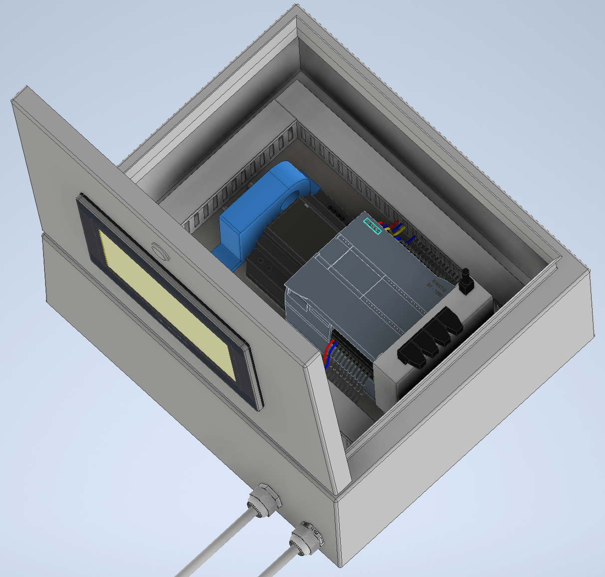
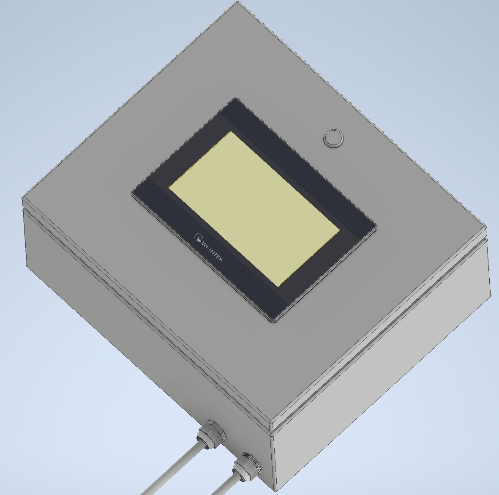

# Projekt

## Wycena

| Nazwa                | Model                                              | Prąd   | Moc  | Szerokość (zajętość szyny) | Ilość  | Cena (brutto) | Niższa cena (brutto) | Notatki                                                                                                                        |
|----------------------|----------------------------------------------------|--------|------|----------------------------|--------|---------------|----------------------|--------------------------------------------------------------------------------------------------------------------------------|
| PLC                  | Siemens Simatic S7-1200 1214C (6ES7214-1AG40-0XB0) | 0,5 A  | 12 W | 110 mm                     | 1 szt. |  [1 340,00 zł](https://allegro.pl/oferta/6es7214-1ag40-0xb0-simatic-s7-1200-cpu-1214c-com-12792546149)  |  [750,00 zł](https://www.olx.pl/d/oferta/plc-siemens-s7-1200-cpu1214c-6es7-2141ag40-0xb0-CID99-ID12ATpf.html)           | Główna jednostka sterująca.                                                                                                    |
| HMI                  | Weintek MT8072iP                                   | 0,5 A  | 11 W | -                          | 1 szt. |  [1 043,46 zł](https://panele-hmi.pl/panel-operatorski-hmi-7-weintek-mt8072ip)  |  [553,99 zł](https://pl.aliexpress.com/item/1005001762611597.html)           | Na Aliexpress jest to zamiennik (Weinview), ale wg opisu na innej stronie jest kompatybilny, jednak nie mam pewności.          |
| Zdalny dostęp        | EasyAccess 2.0 (RZACEA020)                         | -      | -    | -                          | 1 szt. |  [643,29 zł](https://panele-hmi.pl/zdalny-dostep-vpn-easyaccess2-0-weintek)    |  [358,17 zł](https://pl.aliexpress.com/item/1005007086495017.html)           | Przydatna, ale opcjonalna możliwość zdalnego podglądu/zarządzania i przeprogramowywania.                                       |
| Zasilacz             | Mean Well HDR-60-24                                | 2,5 A  | 60 W | 53 mm                      | 1 szt. |  [77,35 zł](https://allegro.pl/oferta/zasilacz-din-mean-well-hdr-60-24-60w-24v-2-5a-dc-14811720043)     |  [51,99 zł](https://pl.aliexpress.com/item/1005007310312109.html)            | W zasadzie dowolny zasilacz 24V   ≥2A na szynę DIN TH35.                                                                       |
| Przetwornik prądowy  | CJ-ACI 20A 4-20mA                                  | -      | -    | 24 mm                      | 1 szt. |  [67,97 zł](https://pl.aliexpress.com/item/4001211720349.html)     | -                    | Moduł do kontroli prądu falownika.                                                                                             |
| Skrzynka elektryczna | F-Elektro F1.0256 (300x350x165)                    | -      | -    | -                          | 1 szt. |  [104,98 zł](https://allegro.pl/oferta/obudowa-szafa-z-tworzywa-z-plyta-montazowa-300x350x165-mm-ip65-f1-0256-15512013263)    | -                    | Możliwe że zmieścilibyśmy się również w 250x350x150, ale lepiszej mieć zapas na przyszłość.                                    |
| Router               | MikroTik RB941-2nD                                 | 0,2 A  | 4 W  | 31 mm                      | 1 szt. |  [98,49 zł](https://allegro.pl/oferta/routerboard-mikrotik-rb941-2nd-300mbps-wifi-mimo-16034216631)     | -                    | Zapewnia komunikację między PLC, HMI i komputerem                                                                              |
| Uchywyt szynowy      | Automat-on AUT000264                               | -      | -    |                            | 1 szt. |  [10,99 zł](https://allegro.pl/oferta/uchwyt-na-szyne-din-th35-ts35-uniwersalne-mocowanie-13027502017)     |  [7,49 zł](https://allegro.pl/oferta/uchwyt-na-szyne-montazowa-din-th35-14714789458)             | Uchwyt router'a.                                                                                                               |
| Szyna montażowa      | DIN TH35                                           | -      | -    | -                          | 0,25 m |  [2,74 zł](https://allegro.pl/oferta/szyna-montazowa-laczeniowa-th35-perforowana-0-25m-f-elektro-16075332494)      | -                    | Dowolna szyna z perforacją.                                                                                                    |
| Korytko kablowe      | XBS ECS2540                                        | -      | -    | -                          | 2 m    |  [14,90 zł](https://allegro.pl/oferta/koryto-kablowe-grzebieniowe-perforowane-25x40-mm-2m-1-szt-14-90-zl-szt-15358423529)     | -                    | Kanał grzebieniowy do prowadzenia okablowania.                                                                                 |
| Kabel                | 3x1 mm² + 16x0,25 (z ekranem)                      | -      | -    | -                          | 2 m    |  [19,80 zł](https://allegro.pl/oferta/przewod-kabel-sterowniczy-w-ekranie-liycy-16x0-25-8826512180)     | -                    | Można użyć jednego ekranowanego wielożyłowego kabla powiedzmy 20x1, ale myślę że będzie lepiej rozdzielić sygnały i zasilanie. |
| Dławnica             | PG11                                               | -      | -    | -                          | 2 szt. |  [2,00 zł](https://allegro.pl/oferta/dlawik-dlawnica-pg-11-mm-ip68-1-szt-16609064904)      | -                    | Montaż dwóch kabli, chyba że stosujemy złącza (zasilanie, sterowanie).                                                         |
| Akcesoria            | Śruby, przewody, patchcord'y, tulejki, itp.        | -      | -    | -                          | -      | -             | -                    | Tym się nie martw.                                                                                                             |
|                      |                                                    | **Razem:** |      | **218 mm**                     |        |  **3 425,97 zł**  |  **1 721,64 zł**         |

## Wizualizacja

